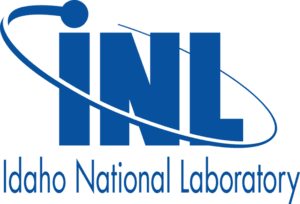
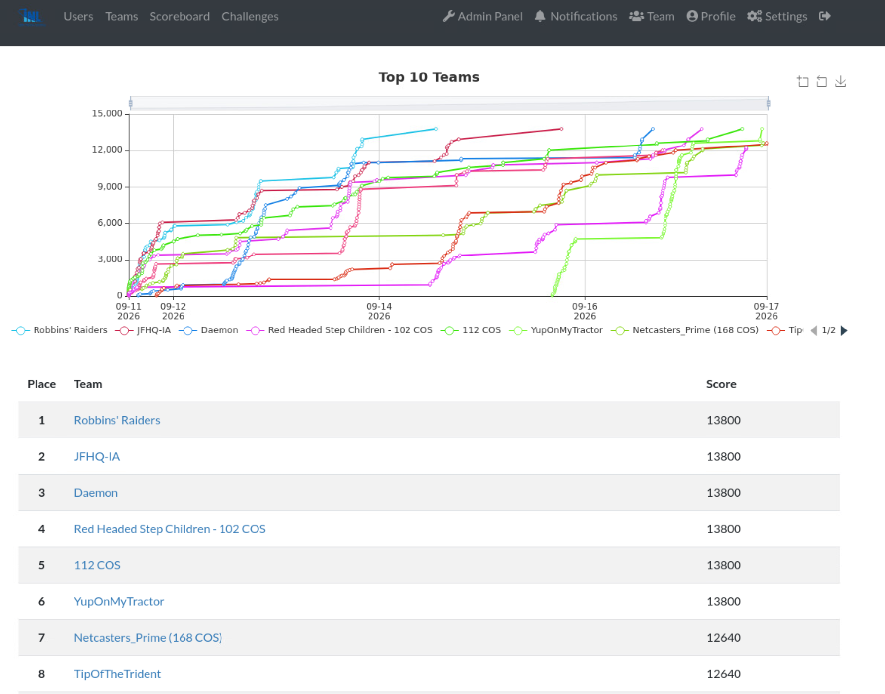
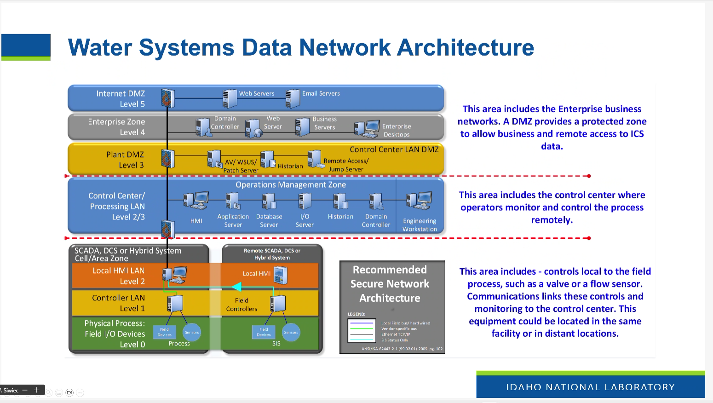
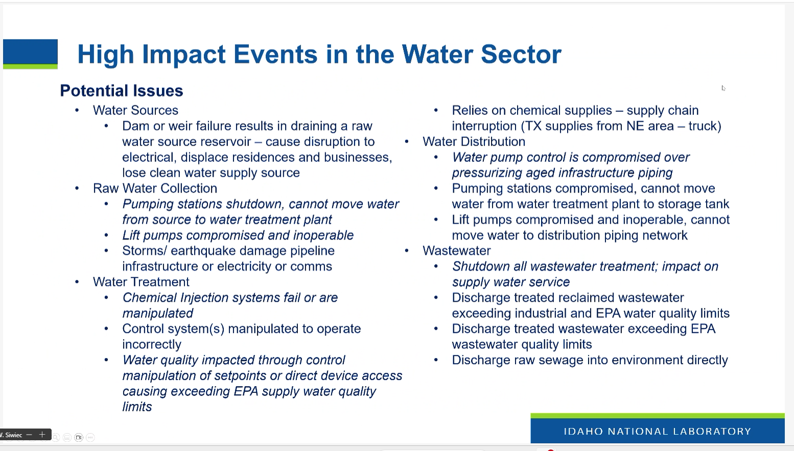
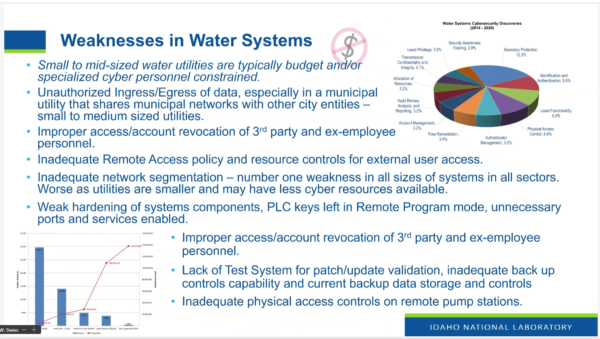
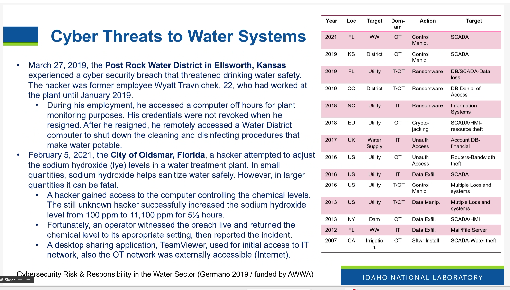

# INL-CTF-2026
  
Repository for **2026 Idaho National Labs (INL) OPT CTF** documenting various Cyber Security scenarios/challenges.

## Scenario
### Incident
  
Celestic Telecom suspects its communications infrastructure has been compromised in a cyber attack.

### Impacted Assets & Stakeholders
Celestic provides core communications services to three critical infrastructure utilities:

1. **Jubilife Water Purification**
2. **Snowpoint Transport**
3. **Veilstone Power**

### Mission Directive (Hunt Forward)
Investigate the suspected intrusion across Celestic's infrastructure to confirm the breach, determine the attack vector and scope, and identify what actions the adversary took.

## Navigation
- ### [Home](./README.md)  
- ### [Challenges](./challenges/challenges.md)  
- ### [Tools](./tools/tools.md)  

## CTF Scoreboard
- Shoutout **JFHQ-IA** for 2nd place!  

## ICS Water System Presentations

