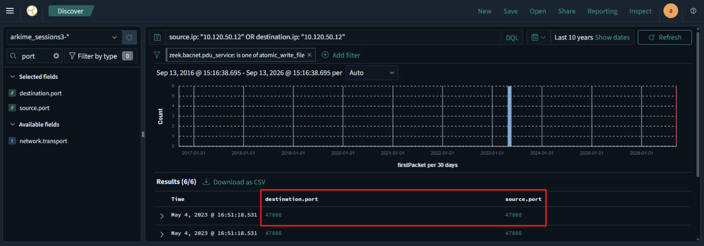
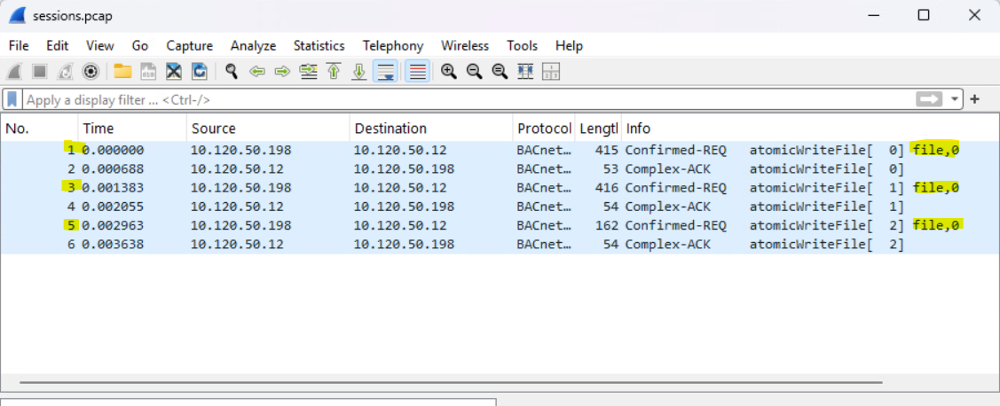

[Home](../../README.md) | [Challenges](../../challenges/challenges.md) | [Tools](../../tools/tools.md) 
# An Alarming BACnet Pain 4

## Scenario
An attacker altered a fire suppression BACnet device's temperature setpoint, causing a heat detector to trigger an alarm prematurely during normal operating temperatures. The malicious change was deployed via an encrypted ZIP archive protected with the password: `jubilife_BMS_configuration!`. Extract the configuration file from the BACnet network traffic and **retrieve the password** assigned to the misconfigured binary sensor to submit as the flag.

## Timeline and Incident Response
Log triage was initiated in Malcolm (OpenSearch) by querying the indexed Zeek logs with `destination.ip: "10.120.50.12" OR source.ip: "10.120.50.12"` combined with `zeek.bacnet.pdu_service: "atomic_write_file"`. This identified 6 distinct log events on standard BACnet UDP port 47808.
  

---

### Finding  
The log metadata revealed the exact timestamp `2023-05-04 16:51:18 UTC` and the sender IP: `10.120.50.198` uploading the configuration file to the fire suppression controller at the IP Address: `10.120.50.12`.

---

Switching to Arkime, the exact conversation was filtered using `ip == 10.120.50.198 && ip == 10.120.50.12 && port == 47808` across the May 4th time window:
  


The raw communication stream was isolated, and the 6 packets were downloaded as `sessions.pcap`. The BACnet APDU structure was then inspected using Wireshark.
  

---

### Finding  
The request-response transaction contained two distinct packet types:
- Packets 2, 4, and 6 were empty server acknowledgments (`Complex-ACK`)
- Packets 1, 3, and 5 were the actual data-bearing requests (`Confirmed-REQ atomicWriteFile`)

Drilling into `stream access → File Data:` revealed the standard ZIP file magic signature (`50 4B 03 04` / `PK..`) starting in packet 1.

---

Because BACnet does not reassemble file transfers like HTTP or TCP streams, the payload `File Data:` was manually carved from each of the three data packets using `Copy → ...as a Hex Stream`. The hex sequences were placed sequentially into `filedata.hex`:
- Packet 1: 350 bytes (offset 0)
- Packet 3: 350 bytes (offset 350)
- Packet 5: 98 bytes (offset 700)

The raw concatenation previously had framing discrepancies throwing a `BadZipFile: Bad magic number for central directory` error. Python was used to convert the 3 raw hex chunks into binary and merge them end-to-end (`350 bytes + 350 bytes + 98 bytes = 798 bytes`).  

The password protected archive was then extracted using the key provided in the initial prompt: `jubilife_BMS_configuration!`. This unpacked the file `fire_suppression_config.txt`.
```shell
PS C:\Users\coreadmin\Downloads> python -c "
>> import zipfile
>>
>> with open('filedata.hex') as f:
>>     lines = [line.strip() for line in f if line.strip()]
>>
>> c1 = bytes.fromhex(lines[0])
>> c2 = bytes.fromhex(lines[1])
>> c3 = bytes.fromhex(lines[2])
>>
>> # Total expected file size from EOCD check: 679 (CD offset) + 97 (CD size) + 22 (EOCD) = 798 bytes
>> # Let's test standard chunk offsets (e.g. 0, 350, 700)
>> # Notice c1 (350) + c2 (350) + c3 (98) = 798 bytes!
>> fixed_data = c1 + c2 + c3
>>
>> with open('fixed.zip', 'wb') as f:
>>     f.write(fixed_data)
>>
>> print(f'Total merged size: {len(fixed_data)} bytes (expected 798)')
>>
>> try:
>>     with zipfile.ZipFile('fixed.zip') as z:
>>         z.extractall(pwd=b'jubilife_BMS_configuration!')
>>         print('[+] Extraction successful! Files found:')
>>         for name in z.namelist():
>>             print(f'=== {name} ===')
>>             print(z.read(name, pwd=b'jubilife_BMS_configuration!').decode('utf-8', errors='ignore'))
>> except Exception as e:
>>     print('[-] Error extracting fixed.zip:', e)
>> "
Total merged size: 798 bytes (expected 798)
[+] Extraction successful! Files found:
=== fire_suppression_config.txt ===
// Configuration File


// object-name, ip-address, firmware-revision, application-software-version
DEVICE
{
  CONFIG 1("fire-suppression", "10.120.50.12", "1.6.1", "5.4", "fire-suppression")
}

//object-name, setpoint, description, location, password
BINARY
{
  BINARY 1(  "HD-OF",   135.0, "Heat Detector - Office",      "Office",       "a3e0f5587d")
  BINARY 2(  "HD-BR",   135.0, "Heat Detector - Break Room",  "Break Room",   "188c23496f")
  BINARY 3(  "HD-LA",   135.0, "Heat Detector - Lab A",       "Lab A",        "83994245cc")
  BINARY 4(  "HD-LB",   72.4,  "Heat Detector - Lab B",       "Lab B",        "927ab89245")
  BINARY 5(  "HD-LC",   135.0, "Heat Detector - Lab C",       "Lab C",        "035a9a360d")
  BINARY 6(  "SD-OF",   100.0, "Smoke Detector - Office",     "Office",       "113c17119a")
  BINARY 7(  "SD-BR",   100.0, "Smoke Detector - Break Room", "Break Room",   "ddf5cd93ea")
  BINARY 8(  "SD-LA",   100.0, "Smoke Detector - Lab A",      "Lab A",        "c4bb43f281")
  BINARY 9(  "SD-LB",   100.0, "Smoke Detector - Lab B",      "Lab B",        "e1009ad76f")
  BINARY 10( "SD-LC",   100.0, "Smoke Detector - Lab C",      "Lab C",        "8db63ca33c")
  BINARY 11( "VENT-OF", 1,     "Ventilation - Office",        "Office",       "2ef6eb06e4")
  BINARY 12( "VENT-BR", 1,     "Ventilation - Break Room",    "Break Room",   "9951f86bb7")
  BINARY 13( "VENT-LA", 1,     "Ventilation - Lab A",         "Lab A",        "4bdc82fd9d")
  BINARY 14( "VENT-LB", 1,     "Ventilation - Lab B",         "Lab B",        "f7b63ea4c3")
  BINARY 15( "VENT-LC", 1,     "Ventilation - Lab C",         "Lab C",        "37ab38cb4f")
}
``` 

### Finding 
Inspecting the sensor entries within `fire_suppression_config.txt` revealed that while all other heat detectors had a setpoint of `135.0`, `BINARY 4 (HD-LB)` had been maliciously dropped to `72.4`:
```shell
BINARY 4(  "HD-LB",   72.4,  "Heat Detector - Lab B",       "Lab B",        "927ab89245")
```

---

## Summary/Solution
  
An attacker maliciously altered a fire suppression system's configuration via an encrypted ZIP archive transferred over BACnet. By capturing the network traffic and extracting the data-bearing `Confirmed-REQ atomicWriteFile` packets, the raw file fragments were manually carved and reassembled to fix the ZIP's central directory alignment. The restored archive, decrypted with `jubilife_BMS_configuration!`, contained `fire_suppression_config.txt`.  

Analysis of this file showed the "Heat Detector - Lab B" sensor's setpoint was dangerously reduced, and the specific password string assigned to this misconfigured `BINARY 4 (HD-LB)` sensor is **`927ab89245`**.