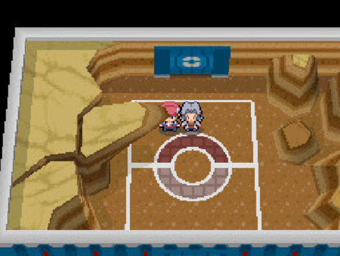

[Home](../../README.md) | [Challenges](../../challenges/challenges.md) | [Tools](../../tools/tools.md) 
# Elite Four Showdown: Bertha Jubilife

## Scenario
The CTF presented an overarching boss challenge called **Elite Four Showdown**. The goal is to unlock a listening TCP service at `192.168.100.5:9004` which requires four specific submission strings from different CEOs. The required format is `$CEO_NAME's Secret Key is: $SECRET_KEY`. Using the starter archive password `30272a6cf9420ad29110a84c700f5c7db2fde08d` harvested from the Jubilife track, retrieve Bertha Jubilife's secret key.

## Timeline and Incident Response
Triage began by using 7-Zip with the provided SHA1 password to unpack `bertha_jubilife_challenge.zip`, yielding `bertha_jubilife_readme.txt` and a target file named `jubilife_challenge.zip`. 
```shell
PS C:\Users\coreadmin\Downloads\BERTHABOSS\bertha_jubilife_challenge> ls


    Directory: C:\Users\coreadmin\Downloads\BERTHABOSS\bertha_jubilife_challenge


Mode                 LastWriteTime         Length Name
----                 -------------         ------ ----
------          5/4/2023   2:41 AM            221 bertha_jubilife_readme.txt
------          5/4/2023   1:58 AM          23326 jubilife_challenge.zip
```

`bertha_jubilife_readme.txt` contained a challenge hint:
```shell
PS C:\Users\coreadmin\Downloads\BERTHABOSS\bertha_jubilife_challenge> Get-Content .\bertha_jubilife_readme.txt
Bertha Jubilife hid her secret key in the specially crafted zip file: jubilife_challenge.zip.

Bertha has a favorite password TYPE, and luckily she only uses lowercase dictionary words for all her passwords.

Good luck!
```

Attempting to extract `jubilife_challenge.zip` normally threw an "Unexpected end of archive" error, and checking the resulting placeholder file with `exiftool` proved the entire file was binary zeros.
```shell
PS C:\Users\coreadmin\Downloads\BERTHABOSS\bertha_jubilife_challenge> exiftool .\jubilife_challenge.zip
ExifTool Version Number         : 13.59
File Name                       : jubilife_challenge.zip
Directory                       : .
File Size                       : 23 kB
File Modification Date/Time     : 2023:05:04 01:58:32+00:00
File Access Date/Time           : 2026:09:18 14:47:20+00:00
File Creation Date/Time         : 2026:09:14 18:56:59+00:00
File Permissions                : -rw-rw-rw-
Warning                         : IO error reading ZIP file
File Type                       : ZIP
File Type Extension             : zip
MIME Type                       : application/zip
Zip Required Version            : 20
Zip Bit Flag                    : 0x0009
Zip Compression                 : Deflated
Zip Modify Date                 : 2023:05:01 21:57:06
Zip CRC                         : 0xc18d29bc
Zip Compressed Size             : 23116
Zip Uncompressed Size           : 24455
Zip File Name                   : jubilife_challenge.jpg
```

---

### Finding
Analysis of the exiftool output revealed a Zip Bit Flag of `0x0009` (binary 1001), indicating two critical file properties:
1. Bit 0 (`0x0001`): The payload is encrypted and password protected.
2. Bit 3 (`0x0008`): The archive uses a Data Descriptor, meaning the compressed size and CRC values are appended after the file data rather than within the local file header.

Since the central directory footer was removed, standard archive tools cannot locate this appended data descriptor. This caused traditional extractors to fail decompression of the payload, resulting in the "Unexpected end of archive" error and yielding a zero byte dummy file.

---

Because the archive's structure was deliberately manipulated, a Python script was created to perform a raw byte inspection directly over the local file header: `inspect_header.py`.
```python
import struct

filepath = 'jubilife_challenge.zip'

with open(filepath, 'rb') as f:
    raw_bytes = f.read(64)
    
print('--- Raw Hex Dump (First 64 Bytes) ---')
for i in range(0, len(raw_bytes), 16):
    chunk = raw_bytes[i:i+16]
    hex_str = ' '.join(f'{b:02x}' for b in chunk)
    ascii_str = ''.join(chr(b) if 32 <= b <= 126 else '.' for b in chunk)
    print(f'{i:04x}  {hex_str:<48}  |{ascii_str}|')

print('\n--- Parsed Local File Header ---')
header = raw_bytes[:30]
# ZIP Local File Header format: <IHHHHHIIIHH (Little Endian)
unpacked = struct.unpack('<IHHHHHIIIHH', header)

print(f'Signature (Magic)    : 0x{unpacked[0]:08x} (Expected: 0x04034b50 / PK\\x03\\x04)')
print(f'Version Needed       : {unpacked[1]}')
print(f'General Purpose Flag : 0x{unpacked[2]:04x} (Expected: 0x0009)')
print(f'Compression Method   : {unpacked[3]} (8 = Deflate)')
print(f'CRC-32               : 0x{unpacked[6]:08x}')
print(f'Compressed Size      : {unpacked[7]} bytes')
print(f'Uncompressed Size    : {unpacked[8]} bytes')
print(f'File Name Length     : {unpacked[9]} bytes')
print(f'Extra Field Length   : {unpacked[10]} bytes')

filename_end = 30 + unpacked[9]
filename = raw_bytes[30:filename_end].decode('utf-8', 'ignore')
print(f'Extracted File Name  : {filename}')
```

Python script output:
```shell
PS C:\Users\coreadmin\Downloads\BERTHABOSS\bertha_jubilife_challenge> python .\inspect_header.py
--- Raw Hex Dump (First 64 Bytes) ---
0000  50 4b 03 04 14 00 09 00 08 00 23 af a1 56 bc 29   |PK........#..V.)|
0010  8d c1 4c 5a 00 00 87 5f 00 00 16 00 1c 00 6a 75   |..LZ..._......ju|
0020  62 69 6c 69 66 65 5f 63 68 61 6c 6c 65 6e 67 65   |bilife_challenge|
0030  2e 6a 70 67 55 54 09 00 03 11 8a 50 64 b7 8a 50   |.jpgUT.....Pd..P|

--- Parsed Local File Header ---
Signature (Magic)    : 0x04034b50 (Expected: 0x04034b50 / PK\x03\x04)
Version Needed       : 20
General Purpose Flag : 0x0009 (Expected: 0x0009)
Compression Method   : 8 (8 = Deflate)
CRC-32               : 0xc18d29bc
Compressed Size      : 23116 bytes
Uncompressed Size    : 24455 bytes
File Name Length     : 22 bytes
Extra Field Length   : 28 bytes
Extracted File Name  : jubilife_challenge.jpg
```
---

### Finding
The byte inspection printed `50 4b 03 04 14 00 09 00 08 00 ...`, confirming the presence of a genuine ZIP local file header.  

It also successfully located the exact starting offset of the encrypted payload. Using the extracted `File Name Length` (22 bytes) and `Extra Field Length` (28 bytes), the payload was pinpointed at byte 80 (`30 + 22 + 28`).

---

To bypass the missing footer, a custom Python script was constructed to handle raw PKZIP stream decryption directly in RAM. The payload start was located at offset `30 + filename_length + extra_length`: `decrypt_jubilife.py`.
```python
import sys
import zlib

crc_table = []
for i in range(256):
    c = i
    for _ in range(8):
        c = (c >> 1) ^ 0xedb88320 if (c & 1) else (c >> 1)
    crc_table.append(c)

def update_keys(keys, char):
    k0, k1, k2 = keys
    k0 = crc_table[(k0 ^ char) & 0xff] ^ (k0 >> 8)
    k1 = ((k1 + (k0 & 0xff)) * 134775813 + 1) & 0xffffffff
    k2 = crc_table[(k2 ^ (k1 >> 24)) & 0xff] ^ (k2 >> 8)
    return [k0, k1, k2]

def decrypt_byte(keys, enc):
    temp = (keys[2] | 2) & 0xffff
    key3 = ((temp * (temp ^ 1)) >> 8) & 0xff
    return enc ^ key3

with open('jubilife_challenge.zip', 'rb') as f:
    data = f.read()

fn_len = int.from_bytes(data[26:28], 'little')
extra_len = int.from_bytes(data[28:30], 'little')
enc_data = data[30 + fn_len + extra_len:]

# Check both possible check bytes (mod_time high byte or high byte of CRC)
mod_time = int.from_bytes(data[10:12], 'little')
crc = int.from_bytes(data[14:18], 'little')
check_bytes = {(mod_time >> 8) & 0xff, (crc >> 24) & 0xff}

candidates = [
    # Pokemon
    "hippowdon", "hippopotas", "whiscash", "golem", "sudowoodo", "rhyperior",
    "rhydon", "rhyhorn", "gliscor", "gligar", "quagsire", "geodude", "graveler",
    "sandshrew", "sandslash", "nidoqueen", "nidoking", "diglett", "dugtrio", "onix",
    "cubone", "marowak", "wooper", "steelix", "swinub", "piloswine", "phanpy",
    "donphan", "larvitar", "pupitar", "marshtomp", "swampert", "nincada", "numel",
    "camerupt", "trapinch", "vibrava", "flygon", "barboach", "baltoy", "claydol",
    "groudon", "torterra", "wormadam", "gastrodon", "gible", "gabite", "garchomp",
    "mamoswine", "drilbur", "excadrill", "palpitoad", "seismitoad", "sandile",
    "krokorok", "krookodile", "stunfisk", "golett", "golurk", "landorus", "diggersby",
    "mudbray", "mudsdale", "sandaconda", "runerigus", "greattusk", "irontreads", "tinglu",
    # Moves & Abilities
    "ground", "earthquake", "earthpower", "sandstorm", "sandstream", "sandveil",
    "sandtomb", "mudshot", "mudbomb", "mudslap", "mudsport", "fissure", "dig",
    "bulldoze", "boneclub", "bonemerang", "bonerush", "drillrun", "magnitude",
    "precipiceblades", "rototiller", "sandattack", "scorchingsands", "shoreup",
    "spikes", "thousandarrows", "thousandwaves", "arenatrap", "eartheater",
    # Ground/Earth dictionary words
    "sand", "dirt", "soil", "earth", "rock", "stone", "bedrock", "loam", "peat",
    "terrene", "terrain", "subsoil", "dust", "crust", "mantle", "strata", "sediment",
    "gravel", "clay", "silt", "landslide"
]

print(f"Testing {len(candidates)} candidates...")
found = False

for pw in candidates:
    keys = [0x12345678, 0x23456789, 0x34567890]
    for b in pw.encode('ascii'):
        keys = update_keys(keys, b)

    k = list(keys)
    dec_header = bytearray()
    for b in enc_data[:12]:
        p = decrypt_byte(k, b)
        dec_header.append(p)
        k = update_keys(k, p)

    if dec_header[11] in check_bytes:
        try:
            k_stream = list(k)
            dec_stream = bytearray()
            for b in enc_data[12:]:
                p = decrypt_byte(k_stream, b)
                dec_stream.append(p)
                k_stream = update_keys(k_stream, p)

            # Raw deflate stream decompress
            decompressed = zlib.decompress(dec_stream, -15)
            print(f"\n[+] PASSWORD FOUND: {pw}")
            with open("recovered_jubilife.jpg", "wb") as out:
                out.write(decompressed)
            print(f"[+] Successfully extracted {len(decompressed)} bytes to recovered_jubilife.jpg")
            found = True
            break
        except Exception:
            continue

if not found:
    print("Password not found in current wordlist. Expanding or formatting check needed.")
```

In Pokémon, **Bertha** is a Ground type master, which hinted the password was a related word. The script tested a list of ground related words against a specific check byte in the file to see which one unlocked it, confirming the password was exactly `ground`.

Python script output:
```shell
PS C:\Users\coreadmin\Downloads\BERTHABOSS\bertha_jubilife_challenge> python .\decrypt_jubilife.py
Testing 118 candidates...

[+] PASSWORD FOUND: ground
[+] Successfully extracted 24455 bytes to recovered_jubilife.jpg
```

---

### Finding
The decrypted stream was pushed through raw RFC 1951 Deflate decompression via `zlib.decompress(payload, -15)`, successfully reconstructing the intact 24,455 byte `recovered_jubilife.jpg`.  

---

Further analysis of `recovered_jubilife.jpg` suggested embedded data. Using the workstation's local steganography utility (`steghide`) and reusing the discovered password `ground`, the hidden payload was successfully extracted from the image.
```shell
PS C:\Users\Public\Desktop> & "C:\Users\Public\Desktop\steghide\steghide.exe" extract -sf .\recovered_jubilife.jpg -p "ground"
```

`Steghide` successfully extracted `jubilife_secret.txt` from the image:
```shell
PS C:\Users\coreadmin\Downloads\BERTHABOSS\bertha_jubilife_challenge> & "C:\Users\Public\Desktop\steghide\steghide.exe" extract -sf .\recovered_jubilife.jpg -p "ground"
wrote extracted data to "jubilife_secret.txt".
PS C:\Users\coreadmin\Downloads\BERTHABOSS\bertha_jubilife_challenge> Get-Content .\jubilife_secret.txt
Congratulations! You have completed Bertha Jubilife's challenge.

Bertha's Secret Key is: ce1e5df1d63331a93fd9f99b2a3a62d795364ad7
```

## Summary/Solution
  
The challenge required bypassing a **corrupted ZIP file missing its central directory footer**. A custom Python script performed `ZipCrypto` decryption directly in memory using the password `ground` to recover a hidden image. Finally, `steghide` was used with the same password to extract Bertha's final secret key: `ce1e5df1d63331a93fd9f99b2a3a62d795364ad7`.