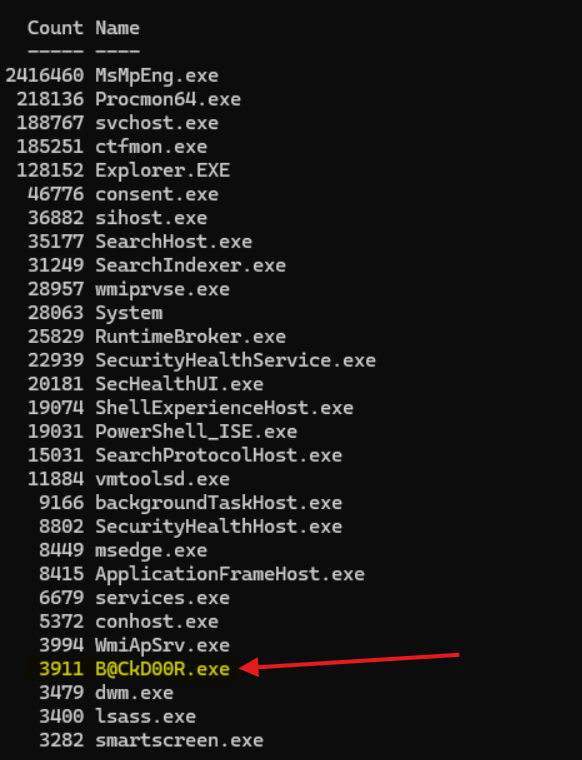

[Home](../../README.md) | [Challenges](../../challenges/challenges.md) | [Tools](../../tools/tools.md) 
# Windows Pane 3

## Scenario
A **malicious executable** was found on one of Jubilife's employee workstations. Initial forensics have determined it is a **reverse TCP callback to a command and control server**. Unfortunately, the employee's machine was located on an older network segment that does not contain monitoring tools like Malcolm. However, all machines on the network run a **custom host based logging system**, which utilizes Scheduled Tasks, PowerShell, and Process Monitor to record key Windows security features after Microsoft Defender identifies malicious activity.

1. What system level process did the adversary migrate into?
2. What was the first file the adversary added to the system?
3. What was the last file the adversary added to the system?

## Timeline and Incident Response
The log package from Abigail's (Jubilife employee) machine was downloaded and extracted.
- ``ENGINEERINGWKS-2023-04-25-3-42`` contained many ``.xml`` and ``.csv`` files with system information for Programs, Users, Files, etc. at the time of the breach. 
```shell
PS C:\Users\coreadmin\Downloads\abigailLogs> ls


    Directory: C:\Users\coreadmin\Downloads\abigailLogs


Mode                 LastWriteTime         Length Name
----                 -------------         ------ ----
d-----         9/12/2026   2:44 PM                ENGINEERINGWKS-2023-04-25-3-42
-a----         3/29/2023  12:12 PM      599538372 ProcMon_ABIGAIL_FORBES_4_28_3_38.csv
```

The ``ProcMon_ABIGAIL_FORBES_4_28_3_38.csv`` file format:
```shell
PS C:\Users\coreadmin\Downloads\abigailLogs> Get-Content .\ProcMon_ABIGAIL_FORBES_4_28_3_38.csv -TotalCount 2
"Time of Day","Process Name","PID","Operation","Path","Result","Detail"
"3:38:35.6627776 PM","Procmon64.exe","8988","RegQueryValue","HKLM\System\CurrentControlSet\Control\WMI\Security\dfe14596-f370-11ed-af59-000c29dd5c22","NAME NOT FOUND","Length: 528"
```

The ``ProcMon`` schema: ``Time of Day | Process Name | PID | Operation | Path | Result | Detail``  

The log entries were then filtered for ``.exe`` processes and grouped by ``Process Name``:
```shell
PS C:\Users\coreadmin\Downloads\abigailLogs> Import-Csv .\ProcMon_ABIGAIL_FORBES_4_28_3_38.csv |
>>     Group-Object "Process Name" |
>>     Sort-Object Count -Descending |
>>     Select-Object Count,
```

After the script finished running, a malicious ``.exe`` was identified: ``B@CkD00R.exe``.  
    

Searched for events involving ``B@CkD00R.exe``:
```shell
PS C:\Users\coreadmin\Downloads\abigailLogs> Import-Csv .\ProcMon_ABIGAIL_FORBES_4_28_3_38.csv |
>>     Where-Object { $_."Process Name" -eq "B@CkD00R.exe" } |
>>     Select-Object "Time of Day", Operation, Path, Result, Detail |
>>     Select-Object -First 100


Time of Day : 3:38:59.3660551 PM
Operation   : Process Start
Path        :
Result      : SUCCESS
Detail      : Parent PID: 6092, Command line: "C:\Users\ABIGAIL_FORBES\Desktop\SECRET\B@CkD00R.exe" , Current directory: C:\Users\ABIGAIL_FORBES\Desktop\SECRET\,
              Environment: ;    ALLUSERSPROFILE=C:\ProgramData; APPDATA=C:\Users\ABIGAIL_FORBES\AppData\Roaming;        CommonProgramFiles=C:\Program Files\Common Files;
```

---

### Finding  
``B@CkD00R.exe`` initial execution began at ``3:38:59.366 PM`` from ``C:\Users\ABIGAIL_FORBES\Desktop\SECRET\B@CkD00R.exe`` with a ``Parent PID 6092``.  

---

Using the ``Parent PID 6092`` identified from the initial process start event, we queried for the parent process that launched ``B@CkD00R.exe``:  
```shell
PS C:\Users\coreadmin\Downloads\abigailLogs> Import-Csv .\ProcMon_ABIGAIL_FORBES_4_28_3_38.csv |
>>     Where-Object { $_.PID -eq "6092" } |
>>     Select-Object "Time of Day", "Process Name", Operation, Path, Result, Detail |
>>     Select-Object -First 50


Time of Day  : 3:38:35.6765908 PM
Process Name : Explorer.EXE
Operation    : Process Profiling
Path         :
Result       : SUCCESS
Detail       : User Time: 3.9062500 seconds, Kernel Time: 8.9531250 seconds, Private Bytes: 83,320,832, Working Set: 177,573,888
```

The parent process resolved to ``Explorer.EXE`` (Windows File Explorer). To confirm the exact execution chain, we filtered for ``Process Create`` events initiated by ``Explorer.EXE`` targeting the malicious payload:  
```shell
PS C:\Users\coreadmin\Downloads\abigailLogs> Import-Csv .\ProcMon_ABIGAIL_FORBES_4_28_3_38.csv |
>>     Where-Object {
>>         $_."Process Name" -eq "Explorer.EXE" -and
>>         $_.Operation -eq "Process Create"
>>     } |
>>     Where-Object {
>>         $_.Detail -match "B@CkD00R|SECRET"
>>     } |
>>     Select-Object "Time of Day", "Process Name", Operation, Path, Result, Detail


Time of Day  : 3:38:59.3660494 PM
Process Name : Explorer.EXE
Operation    : Process Create
Path         : C:\Users\ABIGAIL_FORBES\Desktop\SECRET\B@CkD00R.exe
Result       : SUCCESS
Detail       : PID: 5524, Command line: "C:\Users\ABIGAIL_FORBES\Desktop\SECRET\B@CkD00R.exe"
```

To establish the active execution window of ``B@CkD00R.exe`` (PID 5524), we extracted its corresponding ``Process Start`` and ``Process Exit`` events:
```shell
PS C:\Users\coreadmin\Downloads\abigailLogs> Import-Csv .\ProcMon_ABIGAIL_FORBES_4_28_3_38.csv |
>>     Where-Object {
>>         $_.PID -eq "5524" -and
>>         $_.Operation -in @("Process Start","Process Exit")
>>     } |
>>     Select-Object "Time of Day","Process Name",PID,Operation,Result,Detail


Time of Day  : 3:38:59.3660551 PM
Process Name : B@CkD00R.exe
PID          : 5524
Operation    : Process Start
Result       : SUCCESS
Detail       : Parent PID: 6092, Command line: "C:\Users\ABIGAIL_FORBES\Desktop\SECRET\B@CkD00R.exe" , Current directory: C:\Users\ABIGAIL_FORBES\Desktop\SECRET\...

Time of Day  : 3:39:26.6757816 PM
Process Name : B@CkD00R.exe
PID          : 5524
Operation    : Process Exit
Result       : SUCCESS
Detail       : Exit Status: 0, User Time: 0.0625000 seconds, Kernel Time: 0.1250000 seconds, Private Bytes: 2,969,600, Peak Private Bytes: 3,866,624, Working Set:
               13,828,096, Peak Working Set: 14,598,144
```

---

### Finding  
Parent/child relationship:
- Parent Process: ``Explorer.EXE`` (Windows File Explorer)
- Parent PID: ``6092``
- Child: ``B@CkD00R.exe``
- Child PID: ``5524``
- Start time: ``3:38:59.3660494 PM``
- End time: ``3:39:26.6757816 PM`` (Active for ~27.31 seconds)
- Location: ``C:\Users\ABIGAIL_FORBES\Desktop\SECRET\B@CkD00R.exe``

The ProcMon ``Process Create`` event verifies that the user interactively launched ``B@CkD00R.exe`` via Windows File Explorer (``Explorer.EXE``, ``PID 6092``). The binary ran under ``PID 5524`` for approximately 27 seconds before terminating.

---

Given the reverse shell indicators identified during initial triage, we queried the ProcMon dataset for network activity tied to ``B@CkD00R.exe``:
```shell
PS C:\Users\coreadmin\Downloads\abigailLogs> Import-Csv .\ProcMon_ABIGAIL_FORBES_4_28_3_38.csv |
>>     Where-Object {
>>         $_."Process Name" -eq "B@CkD00R.exe" -and
>>         $_.Operation -match "TCP|UDP|Network"
>>     } |
>>     Select-Object "Time of Day", Operation, Path, Result, Detail


Time of Day : 3:38:59.5709952 PM
Operation   : TCP Connect
Path        : ENGINEERINGWKS.jubilife.com:64974 -> 172.16.240.2:4444
Result      : SUCCESS
Detail      : Length: 0, mss: 1460, sackopt: 1, tsopt: 0, wsopt: 1, rcvwin: 262800, rcvwinscale: 8, sndwinscale: 7, seqnum: 0, connid: 0
```

To determine the full lifespan of the C2 communication channel, we computed how long the TCP connection was open:
```shell
PS C:\Users\coreadmin\Downloads\abigailLogs> if ($netEvents.Count -gt 1) {
>>     # Extract timestamps
>>     $firstEventTime = [datetime]$netEvents[0]."Time of Day"
>>     $lastEventTime  = [datetime]$netEvents[-1]."Time of Day"
>>
>>     # Calculate duration
>>     $duration = $lastEventTime - $firstEventTime
>>
>>     # Display results
>>     [PSCustomObject]@{
>>         "Connection Start" = $netEvents[0]."Time of Day"
>>         "Last Active Event" = $netEvents[-1]."Time of Day"
>>         "Last Operation"    = $netEvents[-1].Operation
>>         "Total Duration"    = "$($duration.TotalSeconds) seconds"
>>     } | Format-List
>> } else {
>>     Write-Host "Only one network event found. Cannot calculate active duration." -ForegroundColor Yellow
>> }


Connection Start  : 3:38:59.5709952 PM
Last Active Event : 3:43:10.7034683 PM
Last Operation    : TCP Send
Total Duration    : 251.1324731 seconds
```

---

### Finding  
Command and Control (C2) Network Activty:
- Source Socket: ``ENGINEERINGWKS.jubilife.com:64974``
- Destination Socket: ``172.16.240.2:4444``
- Protocol / Pattern: Outbound TCP reverse shell (characteristic of default **Metasploit/Meterpreter** payloads over ``port 4444``)
- Session Start: ``3:38:59.570 PM`` (established ~205 ms after initial process execution)
- Final Network Event: ``3:43:10.703 PM``
- Total Duration: ``~251.13 seconds`` (~4 minutes, 11 seconds)

Within 205 milliseconds of execution, ``B@CkD00R.exe`` initiated an outbound TCP connection to ``172.16.240.2`` on ``port 4444``. Outbound traffic associated with this session remained active until ``3:43:10 PM``, persisting past the exit of the ``B@CkD00R.exe`` process and indicating the session was sustained via process injection or thread migration.

---

After establishing the origin, network activity, and execution timeframe for ``B@CkD00R.exe``, we checked whether the binary spawned child processes or additional threads. While no child processes were recorded, ProcMon logged 20 successful ``Thread Create`` events between ``3:38:59.366 PM`` and ``3:39:24.414 PM``:
```shell
PS C:\Users\coreadmin\Downloads\abigailLogs> Import-Csv .\ProcMon_ABIGAIL_FORBES_4_28_3_38.csv |
>>     Where-Object {
>>         $_."Process Name" -eq "B@CkD00R.exe" -and
>>         $_.Operation -eq "Thread Create"
>>     } |
>>     Sort-Object { [datetime]$_."Time of Day" } |
>>     Select-Object "Time of Day", PID, Result, Detail |
>>     Format-Table -AutoSize

Time of Day        PID  Result  Detail
-----------        ---  ------  ------
3:38:59.3660600 PM 5524 SUCCESS Thread ID: 3768
3:38:59.5076853 PM 5524 SUCCESS Thread ID: 7236
3:38:59.5094537 PM 5524 SUCCESS Thread ID: 1200
3:38:59.5106114 PM 5524 SUCCESS Thread ID: 3720
3:39:09.7355431 PM 5524 SUCCESS Thread ID: 2324
3:39:09.8573220 PM 5524 SUCCESS Thread ID: 2340
3:39:09.9262163 PM 5524 SUCCESS Thread ID: 2288
3:39:10.0894003 PM 5524 SUCCESS Thread ID: 2332
3:39:10.1514369 PM 5524 SUCCESS Thread ID: 2196
3:39:10.2132942 PM 5524 SUCCESS Thread ID: 4124
3:39:10.2746123 PM 5524 SUCCESS Thread ID: 2408
3:39:10.3372374 PM 5524 SUCCESS Thread ID: 2380
3:39:10.4010579 PM 5524 SUCCESS Thread ID: 4256
3:39:10.4782650 PM 5524 SUCCESS Thread ID: 4848
3:39:10.5721623 PM 5524 SUCCESS Thread ID: 2412
3:39:13.4496831 PM 5524 SUCCESS Thread ID: 4268
3:39:24.1412017 PM 5524 SUCCESS Thread ID: 5040
3:39:24.2005168 PM 5524 SUCCESS Thread ID: 3436
3:39:24.2753833 PM 5524 SUCCESS Thread ID: 3460
3:39:24.3388842 PM 5524 SUCCESS Thread ID: 3444
3:39:24.4135511 PM 5524 SUCCESS Thread ID: 3260
```

---

### Finding 
There were 3 bursts of ``Thread Create`` events directly related to ``B@CkD00R.exe``:
* ```3:38:59 PM```: Initial execution (4 threads created)
* ``` 3:39:09 PM to 3:39:13 PM```: First burst (11 threads created)
* ```3:39:24 PM```: Second burst (5 threads created)

---


Because stealthy implants frequently migrate into privileged processes prior to exiting, we examined system thread and process activity immediately following the final ``B@CkD00R.exe`` thread burst (``3:39:24 PM`` to ``3:39:27 PM``):
```shell
PS C:\Users\coreadmin\Downloads\abigailLogs> Import-Csv .\ProcMon_ABIGAIL_FORBES_4_28_3_38.csv |
>>     Where-Object {
>>         $_."Time of Day" -ge "3:39:24 PM" -and
>>         $_."Time of Day" -le "3:39:27 PM" -and
>>         $_.Operation -match "Process Create|Thread Create"
>>     } |
>>     Select-Object "Time of Day","Process Name",PID,Operation,Path,Result,Detail |
>>     Sort-Object { [datetime]$_."Time of Day" } |
>>     Format-Table -Wrap

Time of Day        Process Name PID  Operation     Path Result  Detail
-----------        ------------ ---  ---------     ---- ------  ------
3:39:24.1412017 PM B@CkD00R.exe 5524 Thread Create      SUCCESS Thread ID: 5040
3:39:24.2005168 PM B@CkD00R.exe 5524 Thread Create      SUCCESS Thread ID: 3436
3:39:24.2753833 PM B@CkD00R.exe 5524 Thread Create      SUCCESS Thread ID: 3460
3:39:24.3388842 PM B@CkD00R.exe 5524 Thread Create      SUCCESS Thread ID: 3444
3:39:24.4135511 PM B@CkD00R.exe 5524 Thread Create      SUCCESS Thread ID: 3260
3:39:24.6544044 PM winlogon.exe 796  Thread Create      SUCCESS Thread ID: 3416
```

Exactly ``241 milliseconds`` after the final ``B@CkD00R.exe`` thread was created (TID 3260), ``winlogon.exe`` (PID 796) spawned ``Thread ID 3416``.

To determine whether ``TID 3416`` represented a legit OS process or remote thread injection, we audited ``winlogon.exe`` activity immediately following this event:
```shell
PS C:\Users\coreadmin\Downloads\abigailLogs> Import-Csv .\ProcMon_ABIGAIL_FORBES_4_28_3_38.csv |
>>     Where-Object {
>>         $_.PID -eq "796" -and
>>         $_."Time of Day" -ge "3:39:24.654 PM" -and
>>         $_."Time of Day" -le "3:39:27 PM"
>>     } |
>>     Select-Object "Time of Day",Operation,Path,Result,Detail |
>>     Sort-Object { [datetime]$_."Time of Day" } |
>>     Format-Table -Wrap

Time of Day        Operation                                  Path
-----------        ---------                                  ----
3:39:24.6544044 PM Thread Create
3:39:24.6669996 PM Process Profiling
3:39:25.6699754 PM Process Profiling
3:39:26.6666500 PM Load Image                                 C:\Windows\System32\ws2_32.dll...

3:39:26.6679021 PM RegOpenKey                                 HKLM\System\CurrentControlSet\Services\WinSock2\Parameters...

3:39:26.6680693 PM RegOpenKey                                 HKLM\System\CurrentControlSet\Services\WinSock2\Parameters\Protocol_Catalog9
3:39:26.6682082 PM RegOpenKey                                 HKLM\System\CurrentControlSet\Services\WinSock2\Parameters\Protocol_Catalog9\Catalog_Entries64...

3:39:26.6764178 PM CreateFile                                 C:\Windows\System32\mswsock.dll
3:39:26.6765568 PM CreateFileMapping                          C:\Windows\System32\mswsock.dll
3:39:26.6781919 PM Load Image                                 C:\Windows\System32\mswsock.dll...

3:39:26.6800432 PM CreateFile                                 C:\Windows\System32\wshqos.dll
3:39:26.6801798 PM CreateFileMapping                          C:\Windows\System32\wshqos.dll...

3:39:26.6808723 PM QueryOpen                                 C:\Windows\System32\wshqos.dll...
```

Immediately following the creation of ``TID 3416``, ``winlogon.exe`` initialized a full Windows networking stack:
1. Loaded ``ws2_32.dll`` (Windows Sockets 2.0 API).
2. Queried registry configurations under ``HKLM\System\CurrentControlSet\Services\WinSock2\Parameters`` and ``Protocol_Catalog9``.
3. Mapped and loaded ``mswsock.dll`` (Microsoft Windows Sockets Extension) and queried ``wshqos.dll`` (Quality of Service Helper).

---

### Finding 
``winlogon.exe`` (PID 796) was maliciously injected via a remote thread created by ``B@CkD00R.exe``. Under standard operating conditions, ``winlogon.exe`` does not initialize ``Winsock`` libraries or interact with network protocols. The immediate loading of ``ws2_32.dll`` and socket providers directly aligns with the adversary migrating their active reverse shell into a trusted ``SYSTEM`` process before ``B@CkD00R.exe`` terminated at ``3:39:26.675 PM``.

---

With the injected host process confirmed, the team queried ``FileSystem-Files.csv`` to identify files introduced on the endpoint during the active reverse shell window (``3:38:59 PM`` to ``3:43:10 PM`` on ``04/25/2023``):
```shell
PS C:\Users\coreadmin\Downloads\abigailLogs\ENGINEERINGWKS-2023-04-25-3-42> Import-Csv .\FileSystem-Files.csv |
>>     Where-Object { ([datetime]$_.CreationTime).TimeOfDay -ge [timespan]"15:38" -and ([datetime]$_.CreationTime).TimeOfDay -le [timespan]"15:43" } |
>>     Sort-Object { [datetime]$_.CreationTime } |
>>     Select-Object CreationTime,LastWriteTime,Length,FullName |
>>     Format-Table -AutoSize -Wrap

CreationTime           LastWriteTime          Length FullName
------------           -------------          ------ --------
09/16/2018 03:41:58 PM 09/16/2018 03:41:58 PM 9483   C:\Program Files (x86)\Microsoft SDKs\NuGetPackages\System.Net.WebSockets.Client\4.0.0\.signature.p7s
09/17/2018 03:41:34 PM 09/17/2018 03:41:34 PM 9482   C:\Program Files (x86)\Microsoft
                                                     SDKs\NuGetPackages\runtime.win8-arm.Microsoft.NETCore.Runtime.CoreCLR\1.0.2\.signature.p7s
02/23/2019 03:42:30 PM 02/23/2019 03:42:30 PM 18693  C:\Program Files (x86)\Microsoft SDKs\NuGetPackages\nuget.frameworks\4.6.4\.signature.p7s
01/24/2023 03:40:15 PM 01/24/2023 03:41:15 PM 16384  C:\Windows\Logs\waasmedic\waasmedic.20230213_224015_488.etl
01/24/2023 03:41:49 PM 04/25/2023 03:40:49 PM 17824  C:\Windows\Prefetch\APPLICATIONFRAMEHOST.EXE-4CE44C83.pf
01/24/2023 03:41:49 PM 03/08/2023 02:20:56 PM 66927  C:\Windows\Prefetch\SYSTEMSETTINGS.EXE-C47CEF56.pf
01/24/2023 03:41:50 PM 04/25/2023 03:40:50 PM 6838   C:\Windows\Prefetch\SVCHOST.EXE-6389614A.pf
01/24/2023 03:41:50 PM 04/25/2023 03:40:50 PM 4981   C:\Windows\Prefetch\SVCHOST.EXE-47225CC8.pf
01/24/2023 03:41:51 PM 03/07/2023 07:45:54 AM 11125  C:\Windows\Prefetch\BACKGROUNDTRANSFERHOST.EXE-92B4F80E.pf
02/07/2023 03:39:18 PM 04/25/2023 02:47:07 PM 38912  C:\Windows\Prefetch\SERVICEHUB.INDEXINGSERVICE.EX-29DAB86F.pf
02/07/2023 03:40:28 PM 04/25/2023 03:37:47 PM 7598   C:\Windows\Prefetch\WSL.EXE-DC780B58.pf
02/07/2023 03:40:38 PM 03/07/2023 08:30:02 AM 19078  C:\Windows\Prefetch\SVCHOST.EXE-A671E173.pf
02/07/2023 03:40:39 PM 04/25/2023 02:47:04 PM 24159  C:\Windows\Prefetch\MSVSMON.EXE-E953855D.pf
04/25/2023 03:38:21 PM 04/25/2023 03:39:15 PM 16384  C:\Windows\Logs\waasmedic\waasmedic.20230515_223821_978.etl
04/25/2023 03:40:23 PM 04/25/2023 03:40:23 PM 1554   C:\Windows\passwords.pcap
04/25/2023 03:41:46 PM 04/25/2023 03:41:46 PM 5743   C:\Users\ABIGAIL_FORBES\Documents\capcom.doc
```
---

### Finding  
Two notable files were created during this period:
1. ``C:\Windows\passwords.pcap`` — Created at ``3:40:23 PM``. The ``.pcap`` extension indicates a packet capture file and is consistent with network traffic collection or credential-related data gathering.
2. ``C:\Users\ABIGAIL_FORBES\Documents\capcom.doc`` — Created at ``3:41:46 PM``. The file is associated with the Capcom.sys local privilege escalation exploit/tool and is consistent with activity intended to obtain elevated privileges.  

---

## Summary/Solution
   
After initial execution, the adversary migrated their active reverse shell from ``B@CkD00R.exe`` into the trusted system process ``winlogon.exe`` (PID 796) by **injecting a new thread** and **initializing unauthorized WinSock networking components**. An outbound TCP connection to ``172.16.240.2`` on ``port 4444`` (strongly indicative of a **Metasploit/Meterpreter** reverse shell) remained active until ``3:43:10 PM``. Operating under this covert foothold, they first dropped ``C:\Windows\passwords.pcap`` at ``3:40:23 PM`` to stage network packet captures for **credential harvesting**. Shortly thereafter at ``3:41:46 PM``, the attacker added their final payload, ``C:\Users\ABIGAIL_FORBES\Documents\capcom.doc``, to the user's documents folder in preparation for local privilege escalation via the Capcom Exploit.  

**Capcom Exploit** - abuses a legitimately signed anti-cheat kernel driver (``capcom.sys``) that provides a built-in interface to disable CPU execution protections and run arbitrary user code with kernel-level (``SYSTEM``) privileges.