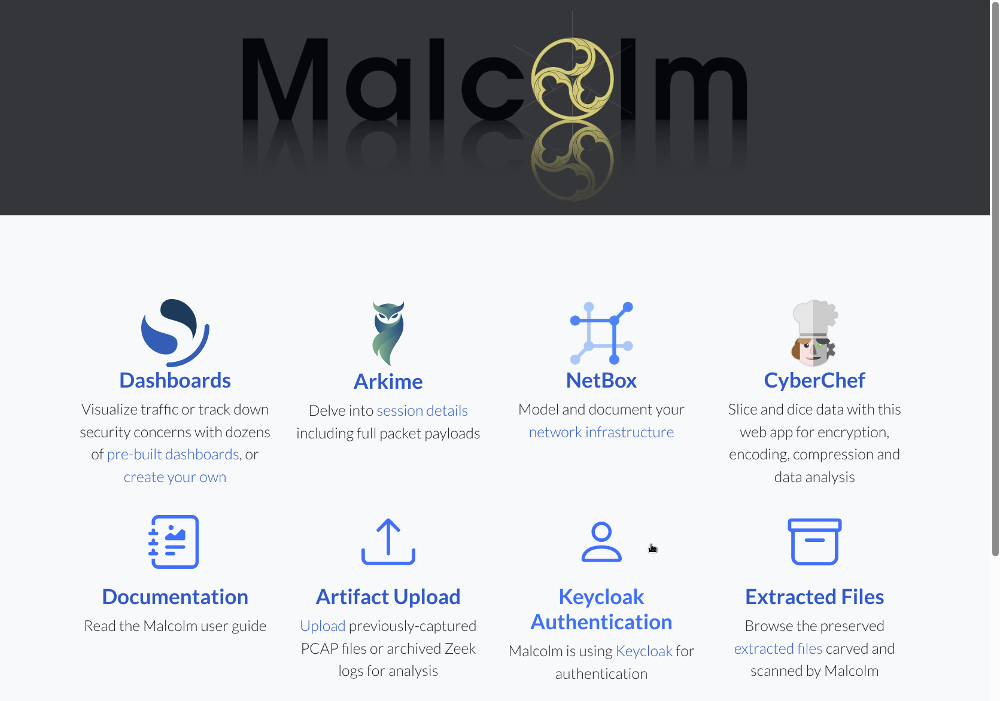
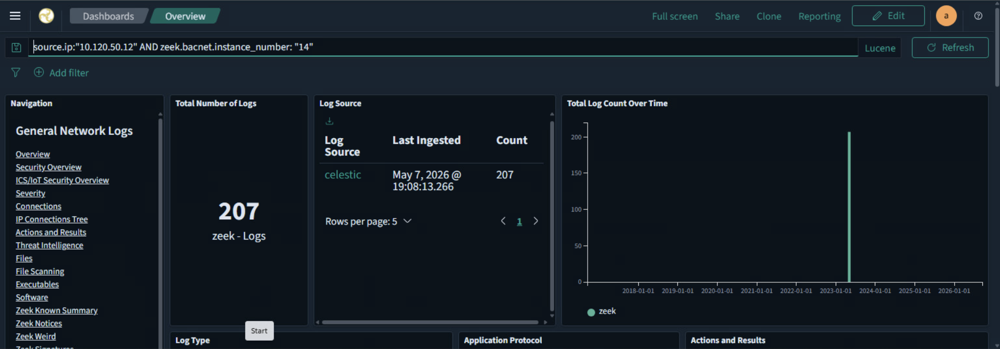
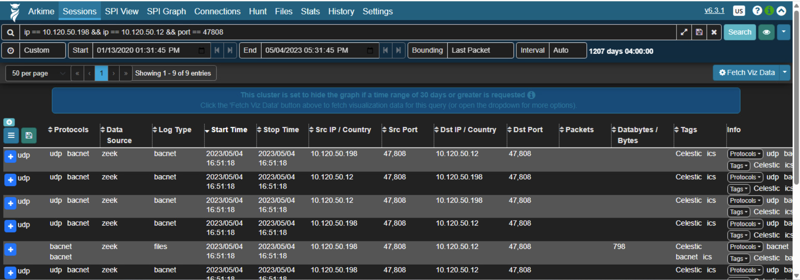
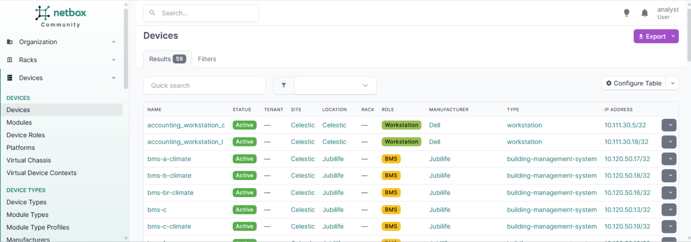
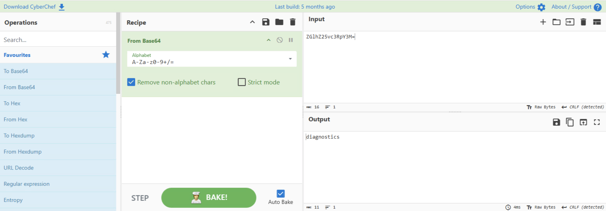
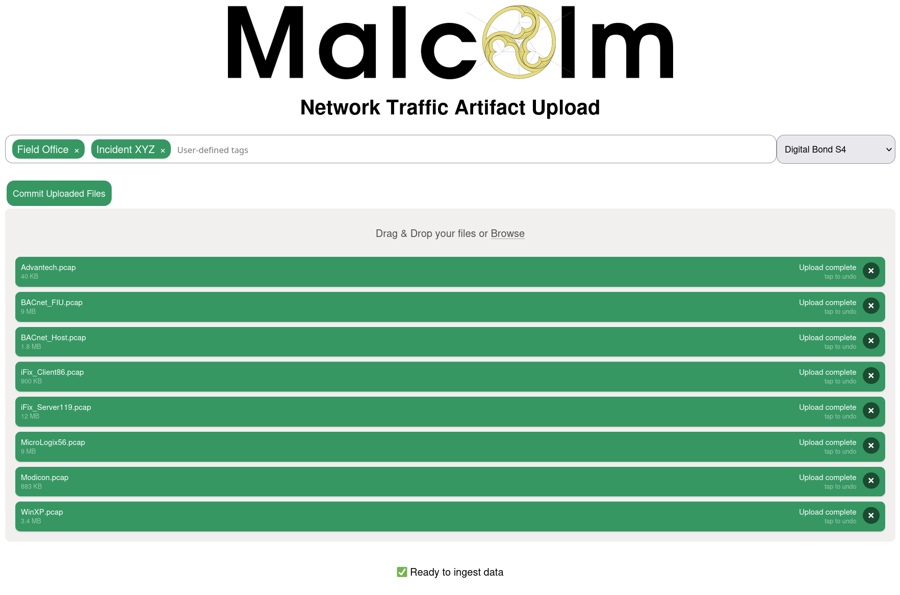
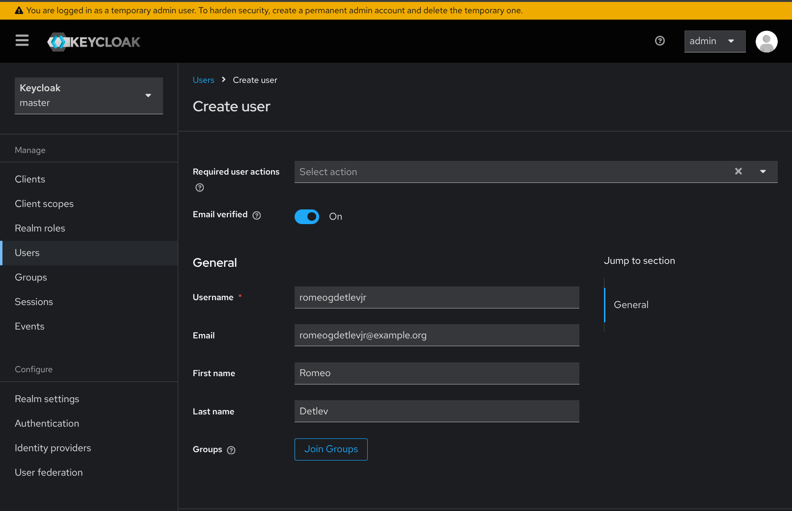
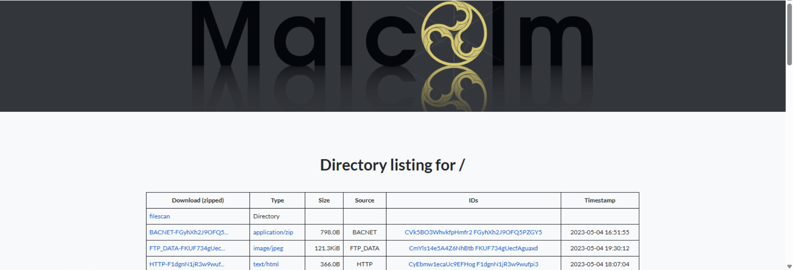
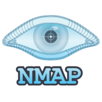
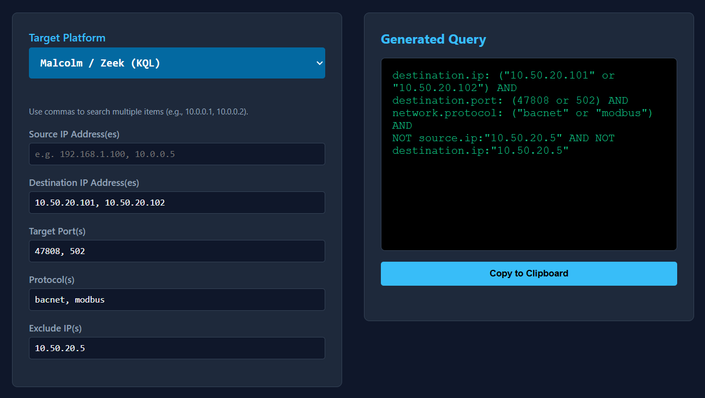

[Home](../README.md) | [Challenges](../challenges/challenges.md) | [Tools](../tools/tools.md) 
# Tools
## Malcolm
  
**Malcolm** is an open source network traffic analysis tool (**NTA**) and network security monitoring (**NSM**) suite developed by **CISA** (Cybersecurity and Infrastructure Security Agency) in partnership with Idaho National Laboratory (**INL**). It packages server industry standard tools into a unified **Docker/Kubernetes** container stack, designed to ingest, enrich, and visualize full packet captures (PCAP), **Zeek** logs, and **Suricata** alerts.

### Zeek
Passive network security monitor that parses raw packet streams into detailed, structured, protocol-specific transaction logs for deep forensic visibility and behavioral analysis.

### Suricata
Rule based intrusion detection and prevention system (**IDS/IPS**) that actively scans network traffic and payloads against known threat signatures to generate real-time security alerts.

### Home Screen
  

## Core Components  
### Dashboards
  
Visualize parsed network data through pre built dashboards with filtering and data manipulation.

### Arkime
  
Network session analysis tool that provides deep insights into network traffic and helps identify security threats.

### NetBox
  
IP address management (IPAM) and network documentation tool that helps manage and document network assets.

### CyberChef
  
"Swiss Army knife" web utility for deobfuscating, decoding, hashing, and manipulating extracted data payloads on the fly.

### Artifact Upload
  
Browser based ingestion portal to drag and drop standalone PCAP files or Zeek/Suricata logs for immediate indexing and processing.

### Keycloak
  
Centralized authentication, RBAC, and identity management across Malcolm's microservices.

### Extracted Files
  
Automatically captures files transmitted across the wire via Zeek, scanning them for malware, signatures, and entropy.

## Wireshark
  
Network traffic analyzer providing full packet inspection, protocol dissection, and deep forensics across hundreds of protocols to isolate anomalies, decode payloads, and export session artifacts.

## Nmap
  
Network scanning tool that enables host/topology discovery, port and service fingerprinting, and vulnerability assessment (misconfigurations, default credentials, and known CVEs).

## Query Gen HTML
  
Static query generation tool used for Malcolm Dashboards, Arkime, and Wireshark. HTML template [`query_gen.html`](./query_gen/query_gen.html) can be opened locally (**no need for internet connection**) with user inputs to dynamically generate network queries for the tool of your choice. Developed with the help of `Google Gemini`!